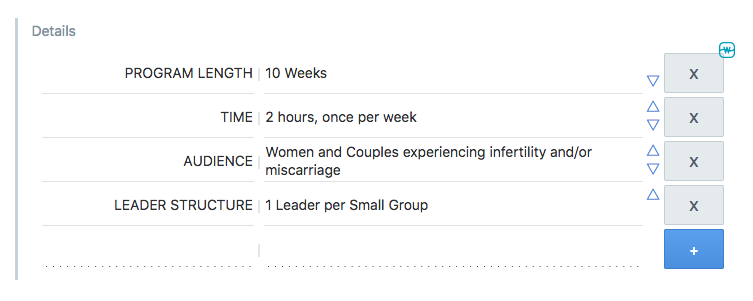
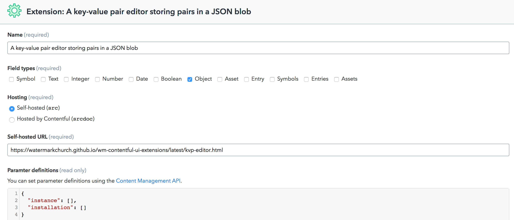
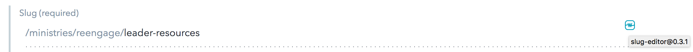
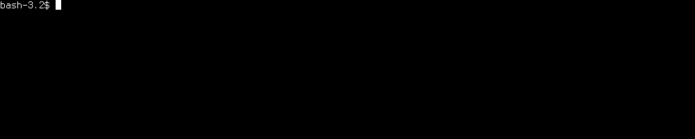
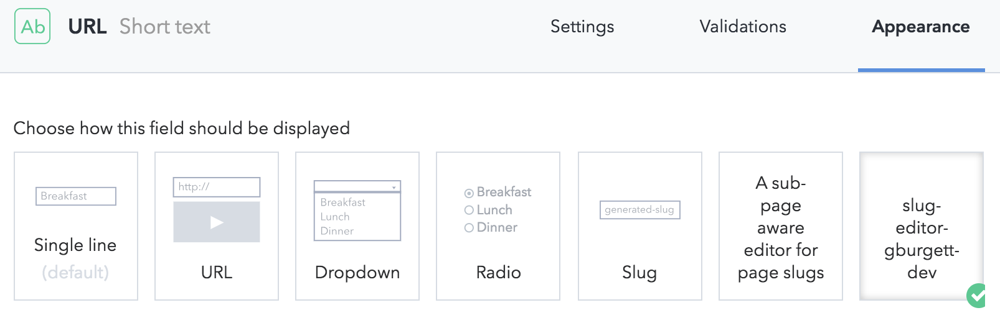

This library hosts the Contentful UI extensions for Watermark Community Church.
[Contentful UI Extensions](https://www.contentful.com/developers/docs/concepts/uiextensions/)
allow us to wrap our own custom UI logic around fields on a content type.

## Extensions:

* [kvp-editor](tree/master/src/kvp-editor)  
    Stores key-value pairs in a JSON field
    
* [Cross-Space Link](tree/master/src/cross-space-link)  
    With a space ID and access token to the other space, it allows selecting an
    entry in that other space and putting it's ID in a Symbol field.
    

## How to use

All the editor extensions are hosted via Github pages at
https://watermarkchurch.github.io/wm-contentful-ui-extensions/{version spec}/{extension ID}.html

The manual way to use one of these extensions is to create it via the Contentful webapp.
Under the `Settings` menu in your space select `Extensions`, and set the self-hosted
URL to point to the page for the particular version.



Look into the [docs folder](docs/) to see what extensions are available at which versions.

Version specifiers are pessimistic:

* `latest` - will always be the latest version of that extension.
* `1` - the most recent minor/patch of the `1.0` major version
* `1.2` - the most recent patch of the `1.2` minor version
* `1.2.3` - patch 3 of version `1.2`

To check which extension version is actually being used, hover over the 
</img> symbol in the
upper-right corner of the field:



## Using the CLI tool

[bin/contentful](bin/contentful) is an executable bash script which wraps commands
for creating, deleting, and developing editor extensions.

```
$ bin/contentful help
bin/contentful <command> [opts]
  Commands:
    create
      Creates an extension in the space pointing to the Github Pages hosting
      for the selected version.

    delete
      Deletes an extension by ID from the space.

    dev
      Enables development of an extension by creating an extension in the space
      that points to 'localhost:8080'.  The webpack-dev-server can then be started
      with 'npm run serve' to begin hacking.

  Flags:
      y) # Yes - skip prompts
      s) # Contentful Space ID - overrides env var CONTENTFUL_SPACE_ID
      a) # Contentful Mgmt Token - overrides env var CONTENTFUL_MANAGEMENT_TOKEN
      e) # Contentful environment ID - overrides env var CONTENTFUL_ENVIRONMENT
      v) # Verbose mode - extra output
      h) # Display help.

  Examples:
    bin/contentful create -s 1xab -e gburgett slug-editor
    bin/contentful delete slug-editor
    bin/contentful dev -s 1xab -e gburgett
```

`bin/contentful create` will walk you through the process of selecting which editor extension to install in your space:


`bin/contentful delete` will delete an extension from within your space



## Developing the extensions

Editor extensions are loaded in an iframe element, so for development purposes
you will create an editor extension that points to `localhost:8080`.
`bin/contentful dev` will do this for you:

```
$ bin/contentful dev
1) kvp-editor
2) slug-editor
Select which extension to create in space ylmoe6ya00k9: 2
This will enable dev server on localhost:8080 for the extension slug-editor-gburgett-dev in the porch v0.1 - staging
Continue? (y/n): y
~/projects/wm/wm-contentful-ui-extensions/src/slug-editor ~/projects/wm/wm-contentful-ui-extensions

✨  Successfully created extension:

┌───────────────────────────────┬────────────────────────────────────────┐
│ Property                      │ Value                                  │
├───────────────────────────────┼────────────────────────────────────────┤
│ ID                            │ slug-editor-gburgett-dev               │
├───────────────────────────────┼────────────────────────────────────────┤
│ Name                          │ A sub-page aware editor for page slugs │
├───────────────────────────────┼────────────────────────────────────────┤
│ Field types                   │ Symbol                                 │
├───────────────────────────────┼────────────────────────────────────────┤
│ Src                           │ https://localhost:8080#slug-editor     │
├───────────────────────────────┼────────────────────────────────────────┤
│ Version                       │ 1                                      │
├───────────────────────────────┼────────────────────────────────────────┤
│ Parameter definitions         │ Instance: 0                            │
│                               │ Installation: 0                        │
├───────────────────────────────┼────────────────────────────────────────┤
│ Installation parameter values │ 0                                      │
└───────────────────────────────┴────────────────────────────────────────┘
~/projects/wm/wm-contentful-ui-extensions
```

Then you select the dev extension in the Contentful webapp:




Then you fire up the webpack dev server using `npm run serve`:

```
$ npm run serve

> wm-contentful-ui-extensions@0.3.1 serve /Users/gburgett/projects/wm/wm-contentful-ui-extensions
> webpack-dev-server -d --config ./webpack.config.js --https

ℹ ｢wds｣: Project is running at https://localhost:8080/
ℹ ｢wds｣: webpack output is served from /
...
```

The first time you run the dev server, it will self-sign an HTTPS certificate.
This cert needs to be added to your exceptions list.
* For firefox, simply navigate to https://localhost:8080/ and follow the prompts to add an exception.
* For other browsers, you'll need to add the certificate to your system using Keychain Access on OSX.

After getting it to load, you should check the
</img>
symbol - the tooltip should say "DEV"

## Running tests

We use Karma to run Mocha tests in a browser environment.  Specs should be created
in the same directory as the file they are testing, and named `*.spec.tsx`.

To run all the specs, `npm run test`.  
To auto-run specs whenever a file changes, `npm run test-watch`.

## Deploying a new version

Once you're ready to deploy a new version of an editor extension, all you need to
do is run `npm version`.  You can choose to create a new major, minor, or patch
version by specifying that on the command line, ex. `npm version patch` to bump
the patch number.

After running `npm version`, push the new commit with `--follow-tags` to make sure
that the new tag gets uploaded: `git push --follow-tags`.  CircleCI takes it from
there.

The `npm version` command will automatically generate the HTML files in the `docs`
directory which power the github-pages site.  Simply pushing to github updates these.
CircleCI runs on every tag push to also deploy the code to NPM, so that we could
load it up via unpkg or jsdelivr if we desired.

## Creating a new extension

Just make a new directory inside of `src/`, and ensure it has an `index.ts(x?)` and
an `extension.json` file.  Once you've done that, `bin/contentful` can create it
in your space.
